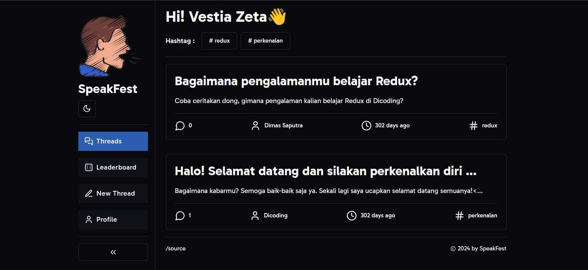

# Submission Dicoding Menjadi React Developer Expert



🎉 Welcome to the breathtaking world of Speakfest! 🚀

Step into the realm of innovation and connectivity with Speakfest - a visionary creation born from my passion and dedication, marking a significant milestone in my journey towards mastery as a React Developer Expert. 🌟

As a proud contender of the prestigious IDCamp scholarship in 2023, I present to you Speakfest, an ingenious application that transcends boundaries, enabling you to craft your threads of thought and explore the vibrant tapestry of conversations woven by individuals across the globe. 💬🌍

Join us as we embark on an exhilarating adventure where ideas know no bounds and connections know no limits. Dive into Speakfest and unleash the power of global discourse at your fingertips! 💡✨

Experience the magic. Experience Speakfest. 💫

[Discover more about the Menjadi React Developer Expert program here! 🎓](https://www.dicoding.com/academies/418)

## Features

- 📘️ Create threads
- 👤 Authentication & Registration User
- 💬 Interaction with everyone in Speakfest
- 🏆 Leaderboard list
- 🌓 Dark & Light mode
- 🎯 Filter threads by category

## Getting Started

To get started with Read Easy, you can follow this step:

1. **Clone the Repository** You can clone this GitHub repository to your local machine using the following command:

   ```shell
   git clone https://github.com/rolandowebdev/speakfest.git
   ```

2. **Running project**

Node.js version `>= 20.x` setup with [pnpm](https://pnpm.io/) is recommended.

```bash
# duplicate & fill environment file
cp .env.example .env.local

# install dependencies
pnpm install

# serve with hot reload at localhost:3000
pnpm dev

# build for production
pnpm build
```

> **_WARNING: Use this repo only as a reference._**
>
> - In accordance with the terms of use at Dicoding, Dicoding Academy class submissions must be your own work.
> - Code obtained from other sources (websites, books, forums, GitHub, etc.) is only used as a reference. The level of similarity cannot be more than 70%.

<br clear="both">
<br clear="both">

> If you have questions or issues, visit the following repository -> [new issue](https://github.com/rolandowebdev/speak-fest/issues/new)
> If this documentation is useful, let's be friends by pressing the follow button on this [profile](https://github.com/rolandowebdev) and star this [repository](https://github.com/rolandowebdev/speakfest.git) 😁️

<br clear="both">

Big thanks for [Dicoding](https://www.dicoding.com/) and [Idcamp](https://idcamp.ioh.co.id/)🙌️

<br clear="both">

Thank you for checking out Speakfest! Happy learning and coding! If you have any questions or encounter any issues, feel free to open an issue on this repository.
